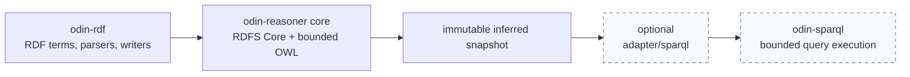

# odin-reasoner

[](https://odin-lang.org/)
[](reasoner/rdfs/profile.md)
[](reasoner/owlrl/profile.md)
[](reasoner/owlrl/conformance-ledger.md)
[](LICENSE)

A bounded, forward-chaining RDF reasoner for Odin. It builds on
[odin-rdf](https://github.com/crapthings/odin-rdf)'s public RDF model, provides
a deliberately small RDFS Core profile, and adds an explicitly documented
OWL 2 RL seed with first-support provenance and resource limits.

**Current development baseline** — adds a no-copy immutable SPARQL Snapshot
that adopts a finished reasoner Store and preserves its indexes. The package is
not publicly released yet; its W3C rule coverage and cross-repository
integration are being strengthened before any release boundary is declared.

`odin-reasoner` is for applications that need inspectable closure over
application-owned facts—not a hidden triple store, network client, or a claim
of complete RDFS or OWL conformance.

## Part of the Odin RDF ecosystem



- [**odin-rdf**](https://github.com/crapthings/odin-rdf) supplies the RDF 1.1
  terms and parsers used by the core.
- **odin-reasoner** owns facts, indexed matching, bounded materialization, and
  provenance.
- [**odin-sparql**](https://github.com/crapthings/odin-sparql) is used only by
  the optional read-only snapshot adapter in [`adapter/sparql`](adapter/sparql).
  The core never imports it.

## Status and scope

| Surface | Included | Boundary |
| --- | --- | --- |
| RDFS Core | Six rules: subclass, subproperty, domain, range, and transitivity | Not complete RDFS; no axiomatic triples or container rules |
| Static OWL profile | 51 direct OWL 2 RL hierarchy, property, schema, value, equality, functional-property, self-restriction, and cardinality rules | A documented seed, not complete OWL 2 RL |
| RDF-list materializers | `owl:oneOf`, `owl:intersectionOf`, `owl:unionOf`, `owl:hasKey`, and multi-property `owl:propertyChainAxiom` | Explicit list and path-frontier limits |
| Consistency analysis | Evidence-carrying reports for implemented false rules | Reports inconsistency; does not discard a successful closure |
| SPARQL integration | Optional copied or Store-adopting immutable default-graph Snapshot, plus borrowed indexed live View | No core dependency on `odin-sparql`; named graphs remain unsupported |

See the [RDFS conformance ledger](reasoner/rdfs/conformance-ledger.md) and the
[OWL profile](reasoner/owlrl/profile.md) for the exact rule surface. The
[OWL conformance ledger](reasoner/owlrl/conformance-ledger.md) maps every
implemented OWL direction to its local gate and declared boundary.
The [OWL fixture corpus](reasoner/owlrl/testdata/README.md) adds parser-to-store
scenarios for cross-rule closure, checked conflicts, and transactional failures.

Use `owlrl.materialize_all` when the application needs the whole supported OWL
closure: it reaches one transactional fixpoint across the static profile and
all five RDF-list families. The focused list entry points remain available for
isolated use. Use `owlrl.materialize_all_checked` to scan that same completed
closure for implemented OWL contradictions without retracting it.

## Why this shape

- **Bounded by contract.** Term, lexical-byte, fact, round, derivation, list,
  path-frontier, and violation limits return explicit errors rather than
  silently truncating work.
- **Closure commits as a unit.** Semi-naive materialization works on a cloned
  store and transfers inferred facts only after a successful fixpoint.
- **Every complete-closure fact has a first support.** `materialize_all`
  retains stable rule IDs and ordered supporting fact IDs for both static and
  RDF-list-derived conclusions.
- **Storage and I/O remain yours.** One in-memory RDF graph is intentional;
  named graphs, persistence, transactions, and networking are outside the API.
- **Dependencies stay directional.** The core uses only `odin-rdf:rdf`; query
  execution is an optional outer integration.

## Quick start

Keep an `odin-rdf` checkout next to this repository, then run the RDFS example
against a Turtle file:

```sh
odin run examples/rdfs_materialize \
  -collection:odin-rdf=../odin-rdf \
  -- example.ttl
```

Check and test the core:

```sh
odin check reasoner -no-entry-point -collection:odin-rdf=../odin-rdf
odin test reasoner -collection:odin-rdf=../odin-rdf

# Optional SPARQL snapshot integration (requires ../odin-sparql as well)
odin test adapter/sparql \
  -collection:odin-rdf=../odin-rdf \
  -collection:odin-sparql=../odin-sparql
```

The example prints asserted facts, inferred facts, and one provenance record.

## Repository layout

```text
reasoner/term       owned RDF-term dictionary and identity
reasoner/store      set-semantics triples and indexed matching
reasoner/import     parser sink that interns borrowed callback values
reasoner/rule       bounded semi-naive rule engine and provenance
reasoner/rdfs       six-rule RDFS Core profile and conformance ledger
reasoner/owlrl      bounded OWL 2 RL seed, list rules, and consistency reports
adapter/sparql      optional immutable snapshot and borrowed indexed View for odin-sparql
examples/           owned-fact and RDFS materialization examples
docs/               architecture and GitHub Pages source
```

## Documentation

- [Architecture](docs/architecture.md) — ownership, identity, indexes,
  transactions, and failure behaviour.
- [RDFS Core profile](reasoner/rdfs/profile.md) — the exact six rules and
  exclusions.
- [OWL profile](reasoner/owlrl/profile.md) — static and list-dependent rules,
  limits, and consistency-report semantics.
- [OWL profile decision](docs/owl-profiles.md) — why this project chooses a
  bounded RL seed, and the entry criteria for EL, QL/OBDA, DL, or Full work.
- [Roadmap](ROADMAP.md) — staged implementation scope.
- [Benchmarks](benchmarks/README.md) — baseline and methodology.
- [Changelog](CHANGELOG.md) and [release guide](docs/releasing.md) — versioned
  compatibility and verification expectations.

## License

[MIT](LICENSE)
